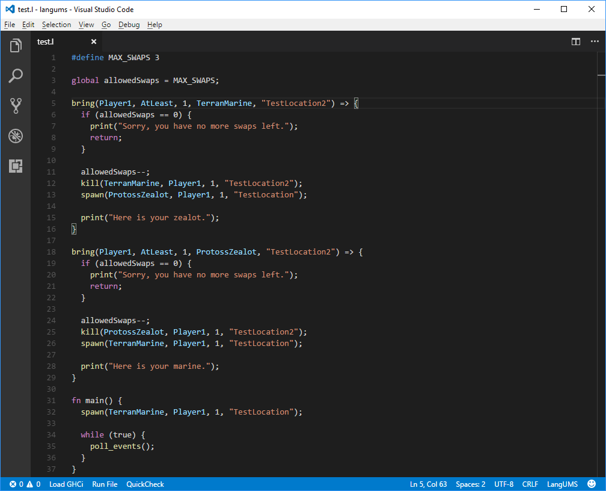

# LangUMS

Support for LangUMS, a programming language by Alexander Dzhoganov for compiling broodwar maps. https://github.com/AlexanderDzhoganov/langums

## Features
* Syntax Highlighting on Instrinsics
* Code Completion on Intrinsics
