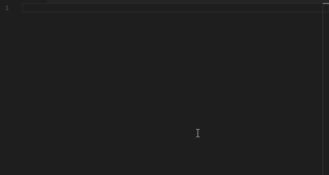

# LangUMS

DEPRECATED: THIS HAS BEEN MERGED INTO THE OFFICIAL LANGUMS REPO, PLEASE VISIT https://github.com/LangUMS/langums-vscode

Support for LangUMS, a programming language by Alexander Dzhoganov for compiling broodwar maps. https://github.com/AlexanderDzhoganov/langums

## Features
* Syntax Highlighting on instrinsics

* Code Completion on intrinsics
* Snippets for intrinsic functions and conditions

* Detection of viable locations from a broodwar map
